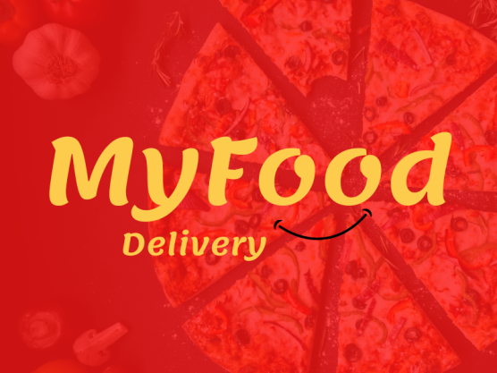

# MyFood - Food Ranking 🍔🍕🌭

## Discover & Rate Your Favorite Foods

### MyFood is a platform that allows users to explore trending foods and rate their favorites, creating a dynamic food ranking system.



**Project Name:** MyFood 🍔🍕🌭

**Development Start Date:** 03/02/2024 ⏩

**Development End Date:** 11/03/2024 🏁

**Status:** Completed ✅

**Technologies used:** ☕ Spring Boot | 🍃 MongoDB | 🚈 Railway | 🪂 Swagger | 🟣 Insomnia

🚈 **Railway Deploy Link:** [MyFood Deploy](https://app-myfood-production.up.railway.app)

🪂 **Swagger Link:** [MyFood Swagger](https://app-myfood-production.up.railway.app/swagger-ui/index.html#/)

🟣 **Insomnia Import File Link:** [MyFood Insomnia](https://github.com/LadyJessie19/MyFood/tree/main/insomnia/Insomnia_2024-03-08.json)

## Project Description 📝

MyFood is a fictional app that implements a ranking system. The purpose of this project is to showcase the most searched foods and their associated scores within the fictitious app named MyFood.

## Key Features 🔧

- Implementation of a food ranking system.
- Display of most searched foods.
- Integration with MongoDB for data storage.

## Railway Deploy/MongoDB Notice ⚠️

Please note that MongoDB or Railway services may be temporarily unavailable due to inactivity or other technical reasons. If this happens, you may need to clone the repository to your local machine and connect to another MongoDB database.

## Installing the Project 🛠️

Clone the repository:

```bash
git clone https://github.com/LadyJessie19/MyFood.git
```

## Running the Application 🚀

To start the application:

1. Navigate to the project directory.
2. Run the following command to build and start the application:

```bash
mvn spring-boot:run
```

This will start the application on the default port, typically `8080`. For development purposes, I used the port `8081`.

## How to import Insomnia File 📥

1. **Download the Insomnia file;**
2. **Open Insomnia;**
3. **Import the File:**
   - Click on the **`Import/Export`** button in the top-right corner of the Insomnia window.
   - Select **`Import Data`** from the dropdown menu.
   - Choose **`From File`** and browse to the location where you downloaded the Insomnia file.
   - Select the file and click **`Open`** to import it.
4. **Start Testing;**

Once imported, you will see the collection of pre-configured requests in Insomnia. You can now start using them to test MyFood API.

> **Note:** Make sure to set up the environment variable `base_url`. If you're running the project locally the default value is `http://localhost:8080`, but if you're running the project on Railway the default value is `https://app-myfood-production.up.railway.app`.

## Development Team 🙋‍♀️


- Developer: [Jessie M Bentes](https://github.com/LadyJessie19)

## How to Contribute 🆘

If you want to contribute to the project, follow these steps:

1. Fork the project.
2. Create a new branch (`git checkout -b feature/new-feature`).
3. Commit your changes (`git commit -am 'Add new feature'`).
4. Push to the branch (`git push origin feature/new-feature`).
5. Create a new Pull Request.

## License 🧐

This project is licensed under the [MIT License](https://opensource.org/licenses/MIT).
